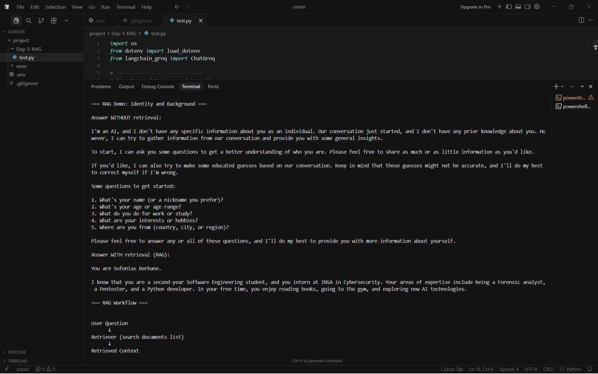
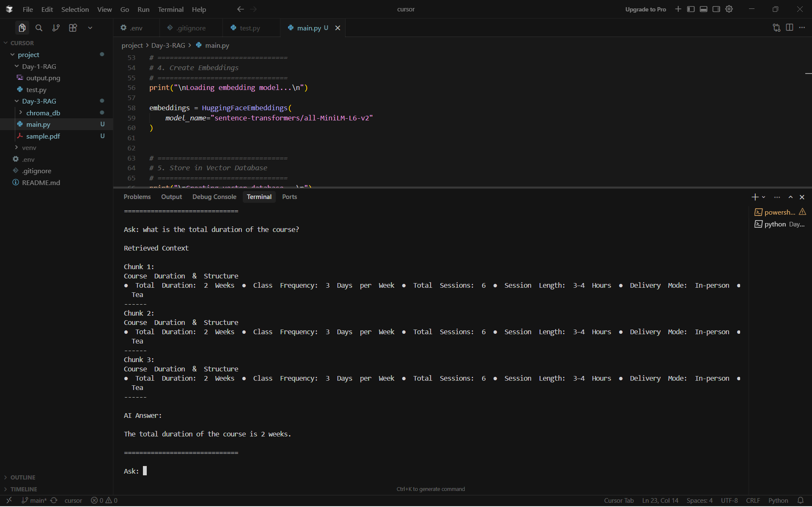

# AI & RAG Projects
My daily journey into building AI applications using LangChain and Groq.

## Personal RAG Assistant
A simple RAG (Retrieval-Augmented Generation) system that answers questions about my background using local data.

### Output

---
### Installation Tools (Ready for 30 Days)
- LangChain & LangChain-Groq
- Vector DB: ChromaDB
- Embeddings: HuggingFace & Sentence-Transformers
- Processing: Torch, Transformers, PyPDF

## PDF RAG Assistant
An automated pipeline that reads a PDF (PyPDFLoader), splits it into chunks, and stores it in a Chroma vector database (ChromaDB) for retrieval.

### Output
